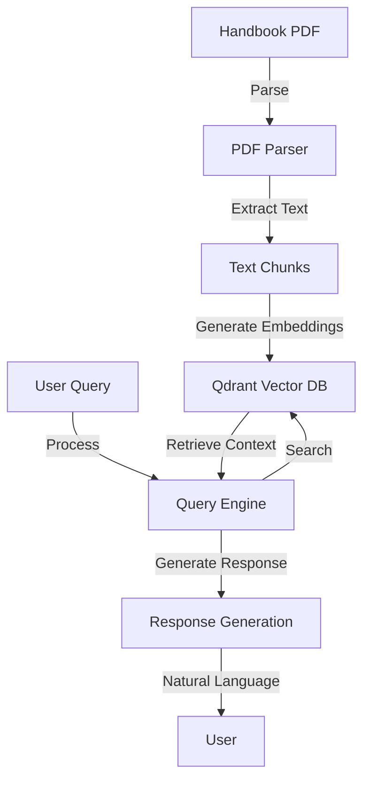
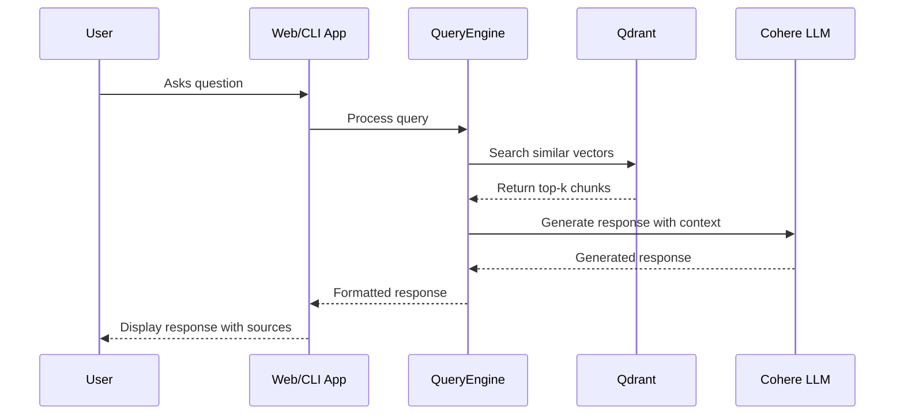

# University of Vavuniya – Faculty of Applied Science Handbook Bot

A Retrieval-Augmented Generation (RAG) assistant that answers academic questions about programmes, regulations, and courses offered by the Faculty of Applied Science (FAS), University of Vavuniya. This AI-powered assistant provides instant, accurate responses by combining semantic search with large language models.

 [](https://www.python.org/downloads/) [](http://localhost:5000) [](https://github.com/yourusername/uov-fas-handbook-bot#-command-line-interface-cli)

## 📋 Current Status (Last Updated: July 2025)

### ✅ Implemented Features
- **Document Processing**: PDF parsing and text extraction
- **Vector Database**: Local Qdrant instance for efficient semantic search
- **API Integration**: Cohere for response generation
- **Dual Interface**:
  - 🌐 **Web Interface**: Interactive Flask-based web UI with markdown support
  - 💻 **CLI**: Command-line interface for quick queries
- **Content Coverage**: 
  - ✅ **Bio Science Department**: Fully processed and available
  - 🚧 **Physical Science Department**: In progress

### ⚠️ Known Limitations
- Response quality depends on the available context in the handbook
- Some specific queries might return incomplete or generic responses

### 🔄 Update Process
- Existing issues will identify and fix with the time 

## ✨  Key Features

### 🔍 Advanced Retrieval
- **Semantic Search**: Find relevant information using state-of-the-art embeddings
- **Context-Aware**: Understands academic context and course structures
- **Source Attribution**: Every response includes references to the original handbook content

### 🤖 Intelligent Generation
- **Natural Responses**: Human-like answers using Cohere's advanced language models
- **Contextual Understanding**: Maintains conversation context for follow-up questions
- **Precision-Tuned**: Optimized for academic and regulatory content

### 🛠️ Technical Highlights
- **Modular Architecture**: Clean separation of retrieval and generation components
- **Efficient Processing**: Optimized chunking and embedding pipeline
- **Local First**: Runs entirely on your machine with optional cloud components
- **Extensible**: Easy to update with new handbook versions or additional data sources

---

## 🗂️  Repository Structure

```
uov_fas_handbook_bot/
├── app.py                    # Flask web application
├── routes.py                 # Web application routes
├── query_handbook.py         # CLI interface
├── configs/                  # Configuration files
├── data/
│   ├── raw/                  # Original PDF documents
│   ├── processed/            # Parsed and structured JSON
│   └── chunks/               # Pre-processed text chunks
├── database/
│   └── qdrant/               # Vector database storage
├── static/                   # Web static files
│   ├── css/                  # Stylesheets
│   ├── js/                   # JavaScript files
│   └── images/               # Image assets
├── templates/                # HTML templates
│   └── index.html            # Main web interface
└── src/
    ├── preprocessing/        # Document processing
    │   ├── pdf_parser.py     # PDF to structured data
    │   └── chunker.py        # Text segmentation
    │
    ├── embedding/            # Text embedding components
    │   ├── embedder.py       # Document embedding logic
    │   └── qdrant_singleton.py
    │
    ├── retrieval/            # Search and retrieval
    │   ├── retriever.py      # Query processing
    │   └── reranker.py       # Result re-ranking
    │
    └── generation/           # Response generation
        ├── generator.py      # Response generation logic
        └── nlp.py            # NLP utilities
```

---

## ⚙️  How It Works

### End-to-End Pipeline



### Key Components

1. **Document Processing**
   - Extracts and structures content from PDF handbooks
   - Splits content into manageable chunks with metadata
   - Generates semantic embeddings for efficient retrieval

2. **Query Processing**
   - Handles natural language queries
   - Performs semantic search against the vector database
   - Ranks and retrieves most relevant content chunks

3. **Response Generation**
   - Formats retrieved context into coherent responses
   - Uses Cohere's language model for natural-sounding answers
   - Includes source attribution for verification

### Data Flow



### Implementation Details

1. **Parsing** – `pdf_parser.py` extracts headings & paragraphs
2. **Chunking** – `chunker.py` processes text into meaningful chunks with metadata
3. **Embedding** – `embedder.py` creates vector representations using `all-MiniLM-L6-v2`
4. **Storage** – Vectors and metadata stored in Qdrant collection `uov_fas_handbook`
5. **Retrieval** – `QueryEngine` handles semantic search and response generation
6. **Generation** – Uses Cohere's API for natural language responses
---

## 🚀 Getting Started

### Prerequisites

- Python 3.8+
- pip (Python package manager)
- Cohere API key (for response generation)

### Installation

1. Clone the repository:
   ```bash
   git clone https://github.com/yourusername/uov-fas-handbook-bot.git
   cd uov-fas-handbook-bot
   ```

2. **Set Up Virtual Environment**
   ```bash
   python -m venv venv
   source venv/bin/activate  # On Windows: venv\Scripts\activate
   ```

3. **Install Dependencies**
   ```bash
   pip install -r requirements.txt
   ```

4. **Configure Environment**
   ```bash
   cp .env.example .env
   # Edit .env with your API keys and configuration
   ```

## 🌐 Web Interface

1. **Start the Web Server**
   ```bash
   python app.py
   ```
   The server will start on port 5000 by default.

2. **Access the Application**
   Open your browser to [http://localhost:5000](http://localhost:5000)
   - Type your question in the input field
   - Press Enter or click the send button
   - View the response with formatted markdown

## 💻 Command Line Interface (CLI)

1. **Run a Single Query**
   ```bash
   python query_handbook.py "Your question here"
   ```
   Example:
   ```bash
   python query_handbook.py "What are the requirements for the IT degree?"
   ```

2. **Interactive Mode**
   ```bash
   python query_handbook.py --interactive
   ```
   - Type your questions one by one
   - Type 'exit' or 'quit' to end the session

## 🔧  Configuration
Edit `src/embedding/config.py` to tweak:
* `DEFAULT_MODEL` (embedding model)
* `DEFAULT_COLLECTION` (Qdrant collection name)
* `QDRANT_STORAGE_PATH` (database directory)
* Vector size, distance metric, batch size, etc.

---

## 📜  License
MIT – see `LICENSE`.

---

Built with ♥ to help FAS students navigate their curriculum effortlessly.
